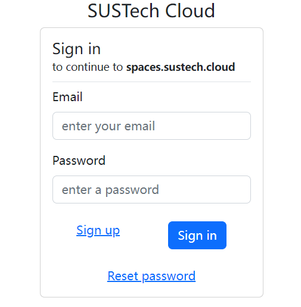
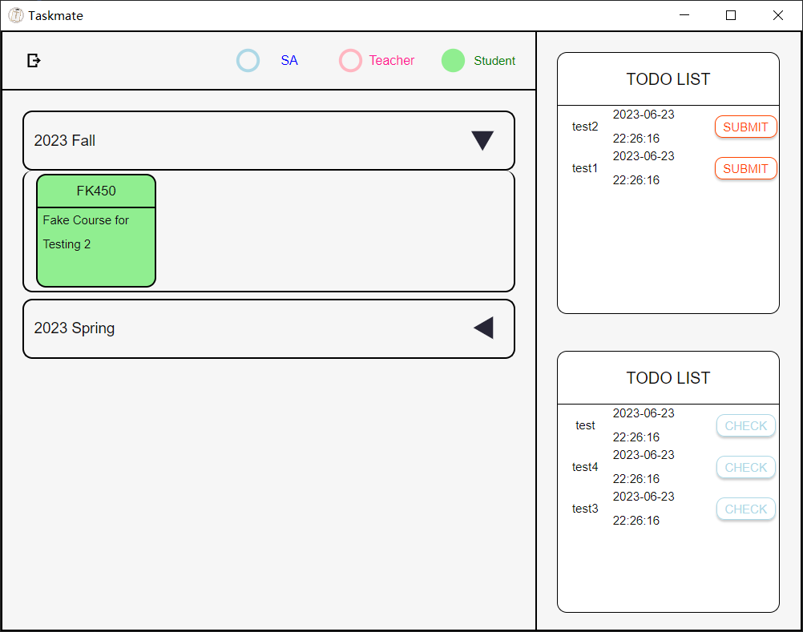
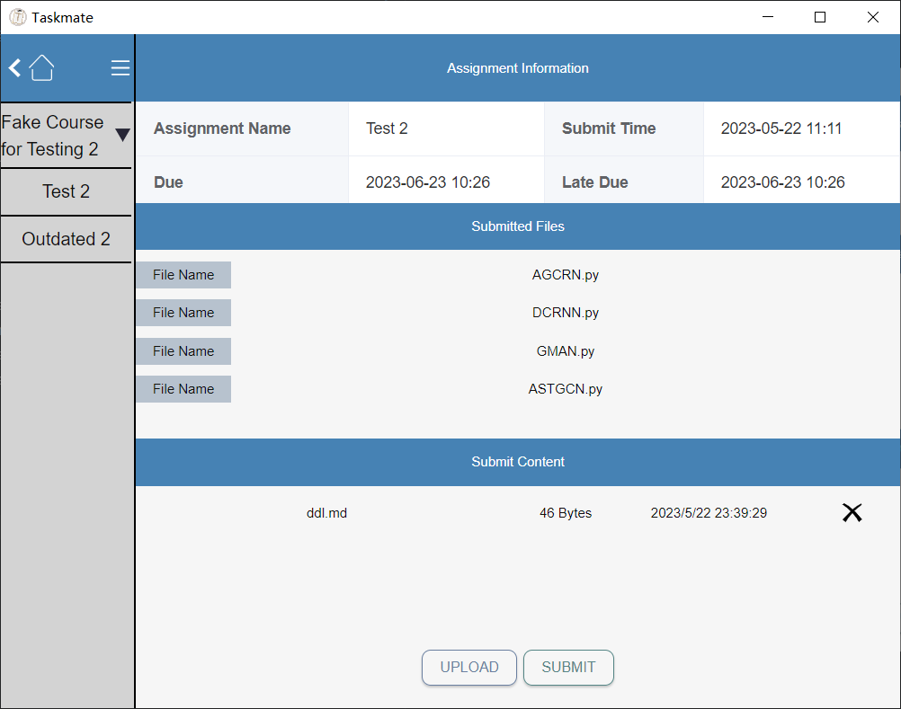

## Download

We have built this project for different operating system. Please click this link and install the latest project in your computer.

<https://github.com/sustech-taskmate/Taskmate/tags>

## CAS Verification

In this interface, you can use your SUSTech Cas account to log in this application.

## Course and Assignment Information

In this interface, you can see the overview of your course information: 
including all courses in different semesters, all assignments before deadline (in the upper right corner).
- If you click 'SUMBIT' button, you can immediately jump to the relative assignments.
- If you click green cards in the relative semester item, you can enter the interface which shows all assignments belong to this semester

## Submit Your Assignments

In this interface, you can submit your assignments
- Please choose the relative assignment which your want to submit in the left bar. If you click successfully, 
all the information about this homework will show in the upper of this interface.
- Meanwhile, you can see all files in the middle of this interface, which are the files you have submitted in the past.
- Click 'UPLOAD' button and choose your new files. 
- Click 'SUBMIT' button and submit your homework

Attention: If you have submitted some files for this assignment, the new files which you 
submit now will replace all the old files.