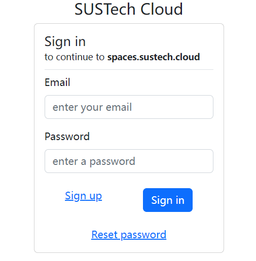
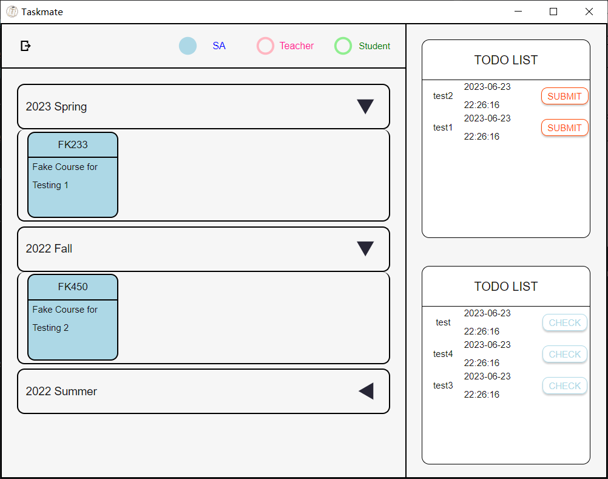
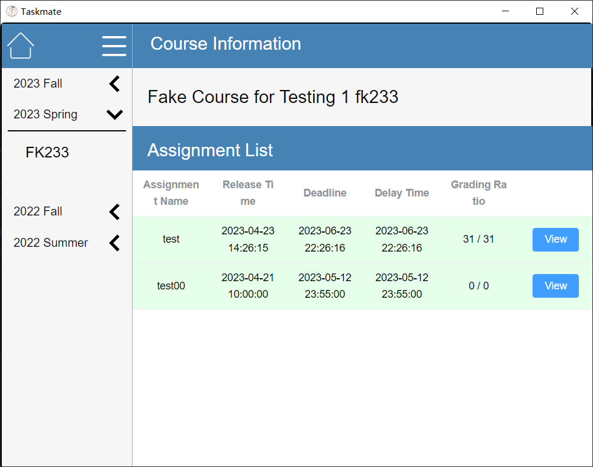
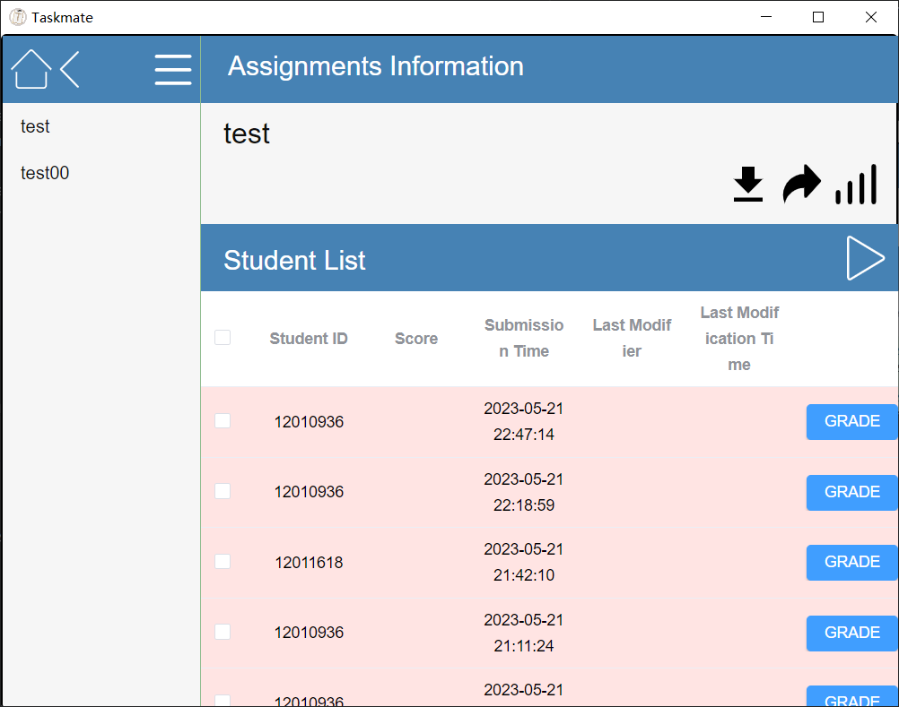
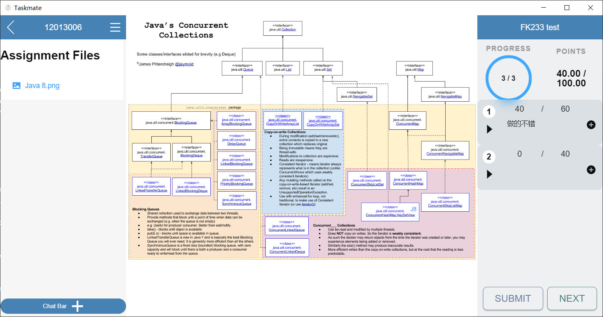
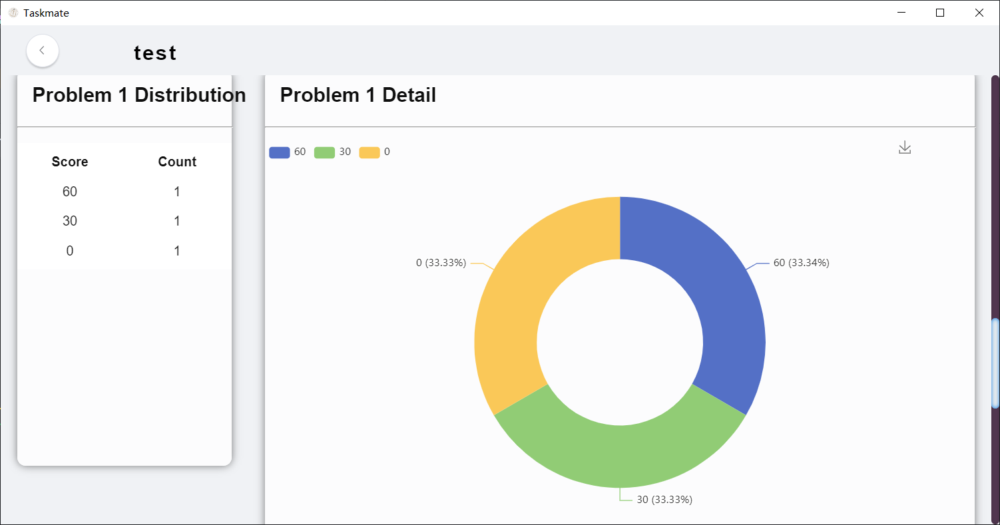

## Download

We have built this project for different operating system. Please click this link and install the latest project in your computer.

<https://github.com/sustech-taskmate/Taskmate/tags>

## CAS Verification

In this interface, you can use your SUSTech Cas account to log in this application.

## Course and Assignment Information

In this interface, you can see the overview of your course information:
including all courses in different semesters, all assignments without grading (in the lower right corner).
- If you click 'CHECK' button, you can immediately jump to the relative assignments.
- If you click blue cards in the relative semester item, you can enter the interface which shows all assignments belong to this semester

## Choose Assignments

In this interface, you can see the overview of your course information:
including all courses in different semesters, all assignments with information.
- You can click the arrow icon in the left bar and click course to get all assignment from this course.
- You can see the information of all assignment including the time and grade ratio.
- You can click view to see students homework.

## Grade Assignments

Please click 'GRADE' button to grade this homework.

In this interface, you can grade students homework

- You can click left file on the left. The content of this file will show in the middle container.
- Our system will split different question number according the server information 
and generate a number of big cards. You can input the value and comments for each question. 
The value above will sum up all value of big cards automatically.
- Meanwhile, you can click the 'plus' icon which will create some small cards. 
You can change the symbol and set the value. The big card will automatically sum up all small cards value.
The comments in small cards will be collected too.

## Assignments Statistics

You can see the overview of score and the score distribution of every question.